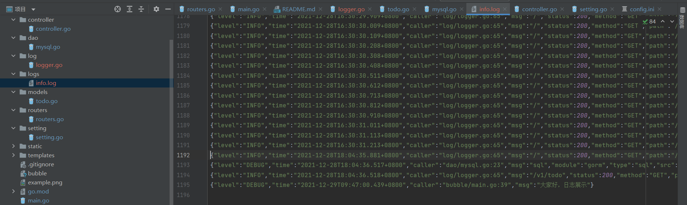

# [Gin_Nodepa](https://github.com/nangongchengfeng/Go_gin/commit/ea6031c31ee47be36e5d4c731f81b03477a99336)清单


一个基于gin+gorm开发的练手小项目，通过该项目可初识go web开发该有的姿势。

前端页面基于vue和ElementUI开发，对前端不熟悉的童鞋可直接下载`templates`和`static`文件夹下的内容使用。

前端部分源码地址：[bubble_frontend](https://github.com/Q1mi/bubble_frontend)。

此项目是采用https://github.com/Q1mi/bubble.git  七米老师讲解上，添加完成的

添加日志记录功能和日志轮询等



```bash
https://www.cnblogs.com/tomtellyou/p/13230163.html
https://www.fdevops.com/2020/08/24/go-gin-zap
```

## 使用指南
### 下载
```bash
git clone https://github.com/Q1mi/bubble.git
```
### 配置MySQL
1. 在你的数据库中执行以下命令，创建本项目所用的数据库：
```MySql
CREATE DATABASE bubble DEFAULT CHARSET=utf8mb4;
```
2. 在`bubble/conf/config.ini`文件中按如下提示配置数据库连接信息。

```ini
port = 9000
release = false

[mysql]
user = 你的数据库用户名
password = 你的数据库密码
host = 你的数据库host地址
port = 你的数据库端口
db = bubble
```

### 编译
```bash
go build
```

### 执行

Mac/Unix：
```bash
./bubble conf/config.ini
```
Windows:
```bash
bubble.exe conf/config.ini
```

启动之后，使用浏览器打开`http://127.0.0.1:9000/`即可。
